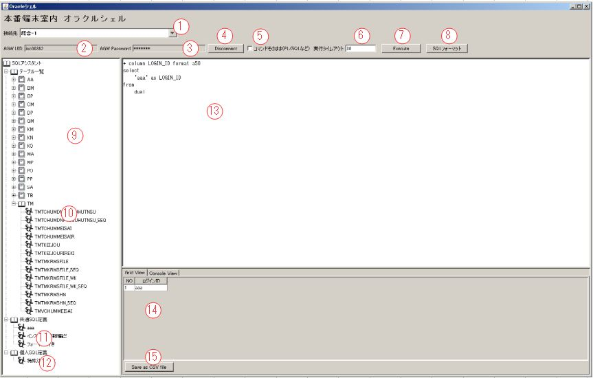
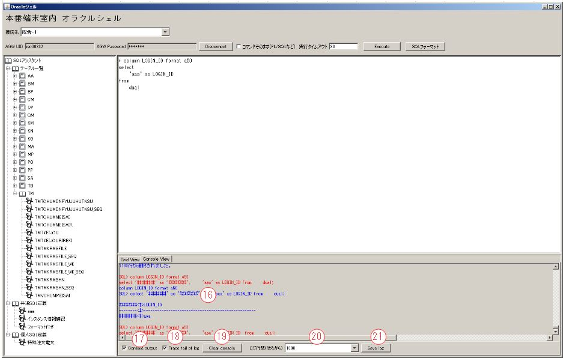
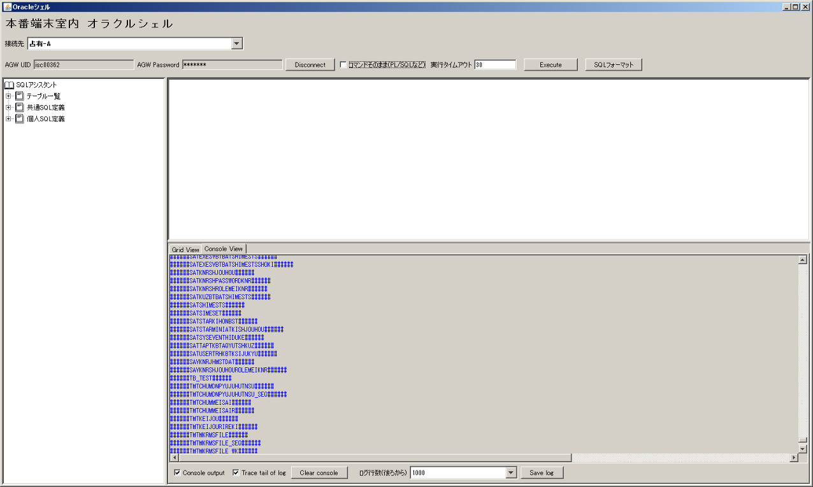
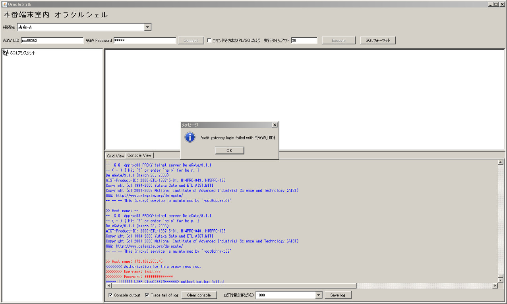
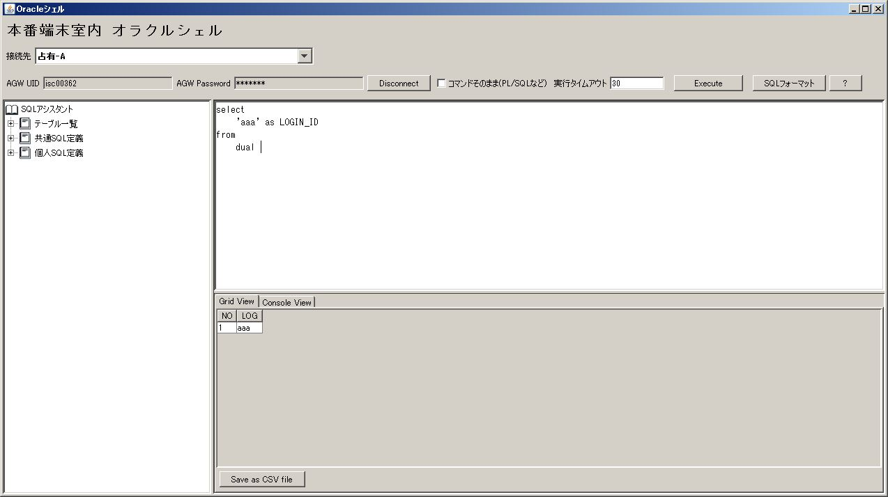
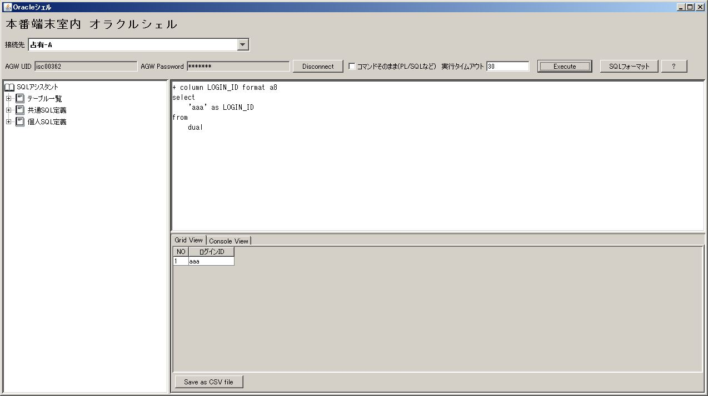

#   本番端末室内オラクルシェル利用ガイド

---
##  画面イメージ



---
1.  接続選択コンポボックス
2.  認証プロキシのログインユーザ  
    *ログオフ状態の場合、入力可能*
3.  認証プロキシのログインパスワード  
    *ログオフ状態の場合、入力可能*
4.  Connect/Disconnectボタン
5.  特殊SQL発行チェックボックス。  
    ここをチェックすると、SQLを整形、チェックしないままでサーバに送る。
6.  実行タイムアウト設定テキストボックス
7.  SQL発行ボタン
8.  SQLフォーマットボタン
9.  SQLアシスタントボックス
10. テーブル一覧のテーブル名
11. 共通事前定義SQL
12. 個人事前定義SQL
13. SQL編集テキストボックス
14. SQL実行結果ボックス
15. SQL実行結果保存ボタン
16. SQL実行ログコンソール
17. SQL実行ログ出力チェック
18. SQL実行ログ追跡チェック
19. SQL実行ログクリアボタン
20. 維持ログ行数コンポボックス
21. ログ保存ボタン

##  画面操作
### ログイン


---
1.  接続操作
    1.  「1. 接続選択コンポボックス」で接続先環境を選択する。
    2.  「2. 認証プロキシのログインユーザ」で認証プロキシのユーザIDを入力する。
    3.  「3. 認証プロキシのログインパスワード」で認証プロキシのパスワードを入力する。
    4.  「4. Connect/Disconnectボタン」をクリップして、事前定義したスクリプトでログインを
      を行う。
2.  接続成功した結果
    
    1.  エラーが報告されない。
    2.  テーブル一覧、共通SQL定義、個人SQL定義が表示される。
    3.  「2. 認証プロキシのログインユーザ」と「3. 認証プロキシのログインパスワード」
      が入力不可になる。
3.  接続失敗した結果
    
    1.  エラーメッセージボックスが確認される。

### SQL編集作業
1. 「9. SQLアシスタントボックス」で直接SQL入力できる。
2. 「10. テーブル一覧のテーブル名」、「11. 共通事前定義SQL」、「12. 個人事前定義SQL」で対象テーブル名かSQL名を
   ダブルクリップして、事前定義SQLが「9. SQLアシスタントボックス」に入れられる。
3. 「9. SQLアシスタントボックス」の「共通SQL定義」か「個人SQL定義」に右クリックすると、
   「13. SQL編集テキストボックス」の内容を事前定義SQLとして登録できる。
4. 「11. 共通事前定義SQL」か「12. 個人事前定義SQL」を右クリックすると、「13. SQL編集テキストボックス」の内容で
    事前定義SQLを更新出来る。また、削除も出来る。
5. 「8. SQLフォーマットボタン」ボタンをクリックすると、「13. SQL編集テキストボックス」の内容を整形される。
6.  SQLテキストで最初からの"+ "で始まる行はフォーマット文字として認識し、そのままサーバに転送される。  
    ▼*サンプル*
    
         + column LOGIN_ID format a50  
         select
             'aaa' as LOGIN_ID  
         from
             dual

### SQL実行作業
1.  基本的に「7. SQL発行ボタン」をクリックして、「13. SQL編集テキストボックス」の内容を整形し、サーバに送って実行する。
2.  チェック・整形ルール
    1.  ```&変数名``` が見つかった場合、変数入れ替えダイアログを表示し、入力した変数値でSQLを入れ替えする。
    2.  改行コード（0x0d,0x0a）がある場合、改行コードをスペースに変える。  
    3.  ```INSERT|DELETE|UPDATE|PURGE|DROP|ALTER|EXECUTE|CREATE|TRUNCATE|COMMIT|BEGIN|END```がSQLに存在するかを
        チェック、存在する場合、警告メッセージを表示し、実行を諦める。
    4.  SQLは`;`で終了する場合、`;`を削除する。
    5.  SQL前後のスペースを削除する。
    6.  SQLは`select *`で始まる場合、下記のように変更する。
            
            select '########' as \"%%%%%%%%\", t_t_t_t_t_t_t_t.* from (元のSQL) t_t_t_t_t_t_t_t
    7.  SQLは`select`で始まる場合、下記のように変更する。
            
            select '########' as \"%%%%%%%%\"," + 元のSQLでselectを抜いた部分
    8.  SQLは`select`で始まってない場合、エラーとして、警告メッセージを表示し、、実行を諦める。
    
    ※「5.  特殊SQL発行チェックボックス」がチェックされた場合、「2.」からのチェックが発生しない。
    
3.  タイムアウトについて
    1.  SQL実行タイムアウト

        大量データを出力されるSQLが実行される場合、長時間大量なネット通信で障害に及ぶことが考えられるので、
        SQLが発行されてから実行終了までタイムアウトが設定される。
        *   タイムアウトが発生した場合、SQLPLUSに対して`[CTRL]+C`が送られる。
        *   メッセージボックスでタイムアウトが発生することを通知する。
        *   タイムアウト時間は「6.  実行タイムアウト設定テキストボックス」で設定する。
            デフォールト値があるが、自由に変えられる。
    2.  ログインタイムアウト

        セキュリティの理由で、DBに接続して、長時間で操作しないと、自動ログアウトする。
        *   「操作しない」の意味はすべてのコントロールにマウス移動しない、キーボードのキーを押さないことを意味する。
        *   タイムアウト時間は定義ファイルで定義される。

### 項目名表示について
SQL文が実行され、「14. SQL実行結果ボックス」に結果を表示されるが、列名はSQL文発行されたままになる。
SQL文で取得したコラム名を自動に人間に読みやすい形に変換することでユーザに役立つ。

1.  自動変換ファイルについて、下記のパスにおかれる。  
    `ソフトインストールパス\fieldname.csv`
    
    フォーマットは　`SQLコラム名,表示用コラム名`　である。  
    ▼*サンプル*
    
        TUSK,証券会社コード
        LOGIN_ID,ログインID
2.  コラムサイズについて

    本ツールのバックグランドはSQLPLUSですので、SQLPLUSが実データの表示幅にあわせ、コラムタイトルを一部消すことがある。
    これを回避するため、コラムサイズを強制指定できる。

    ▼*サンプル*
    
        select
            'aaa' as LOGIN_ID  
        from
            dual
             
     コラムLOGIN_IDは8文字分が必要、データ`'aaa'`は3文字のみ、通常、下記のような結果になる。  
     

    ▼*サンプル*
    
        + column LOGIN_ID format a8  
        select
            'aaa' as LOGIN_ID  
        from
            dual
            
    コラムLOGIN_IDのサイズを8文字に固定して、日本語`ログインID`に変換される。
    

##  設定
### サーバとの対話手続きについて
コードは`インストールディレクトリ\config\DBConnect.groovy`の`static Closure getCreateSqlPlusConnectClosure()`に定義される。

1.  ログインするときの手続き定義

        appendAsLogon(builderName: "root") {
            talk(
					//ログイン完了した場合、テーブル一覧を取得する。
                    prepareLines: "select '######' || table_name || '######' from cat where substr(table_name, 1, 2) not in ('AQ', 'QT') order by 1;"
            ) {
				//"Host name:"を受信できるまで待ち、接続先ホスト名を送信
                wait(~/Host name:/)
                send(attr.hostname)
				//"Username:"を受信できるまで待ち、認証プロキシユーザIDを送信
                wait(~/Username:/)
                send("?{AGW_UID}")
				//"Password:"を受信できるまで待ち、認証プロキシユーザパスワードを送信
                wait(~/Password:/)
                password("?{AGW_PWD}")
				//"login:"か"Username:"を受信できるまで待ち、"login:"を受信できたら、OSユーザIDを送信
				//"Username:"を受信できたら、エラーで終了する。
				wait(~/login:/) {
                    error(~/Username: *$/, [error: "Audit gateway login failed with ?{AGW_UID}"])
                }
                send(attr.osUid)
				//"Password:"を受信できるまで待ち、OSユーザパスワードを送信
                wait(~/Password:/)
                send(attr.osPwd)
				//コマンドPromptを待ち、しかし、"Password:"を受けたら、エラーで終了する。
                wait(~/\]\$/) {
                    error(~/^ *Password: *$/, [error: "OS login failed with aplusr01"])
                }
				//SQLPLUSを起動する。
                send("sqlplus -L ${attr.oraUid}/${attr.oraPwd}" as String)
				//コマンドPromptを待ち、着たら、ページサイズを送信する。
                wait(~/^ *SQL> *$/)
                send("set pagesize 10000")
				//コマンドPromptを待ち、着たら、行サイズを送信する。
                wait(~/^ *SQL> *$/)
                send("set linesize 10000")
				//コマンドPromptを待ち、着たら、項目分割文字を送信する。
                wait(~/^ *SQL> *$/)
                send("set colsep '<#>'")
				//コマンドPromptを待ち、着たら、ログインできるとする、次は子処理（テーブル一覧取得）
                finish(~/^ *SQL> *$/, [result: TalkResult.FORWARD])
				//ログイン完了後、テーブル一覧の登録処理
                regex(
                        matchedResult: TalkResult.CONTINUE,
                        pattern: ~/^######.*######$/,
                        processor: { GraphicSqlTerminal.controller.tableNameList << it[6..-9] })
				//ログイン完了後、テーブル一覧取得も終わって、コマンドPromptが出るを待ち、本手続き完了
                regex(matchedResult: TalkResult.STOP, pattern: ~/^ *SQL> *$/)
            }
        }
2.  ログアウトするときの手続き定義

        appendAsLogoff(
                builderName: "root",
                prepareLines: ""
        ) {
            talk(
                    unlessResult: TalkResult.STOP
            ) {
                wait(~/^ *SQL> *$/)
                send("exit")
                wait(~/\$/)
                send("exit")
                send("exit")
                finish(~/Host name:/, [result: TalkResult.STOP])
            }
        }
3.  オラクルSelectコマンドを発行するときの結果処理  
    **※環境に応じて修正がほぼない。**

        appendAsSelect(builderName: "oracleSelect") {
			// タイトル処理コントロールを設定
            appendAsTitle(builderName:  "oracleTitle")
			// データ行処理コントロールを設定
            appendAsRowdata(builderName: "oracleRowdata")
			// コマンドPromptが出ると、データ全量取得完了とされる。
            regex(matchedResult: TalkResult.STOP,
                    pattern: ~/^ *SQL> *$/)
        }

4.  実行キャンセル処理
    **※環境に応じて修正がほぼない。**
    
        appendAsCancel(builderName: "root") {
            talk(
                    unlessResult: TalkResult.STOP
            ) {
				//　Ctrl+Cを送る。
                raw(ControlCode.CTRL_C)
            }
        }
5.  Select以外のコマンド実行処理
    **※環境に応じて修正がほぼない。**

        appendAsExecute(builderName: "root") {
            talk {
				// コマンドPromptが出ると、実行完了とされる。
                finish(~/^ *SQL> *$/, [result: TalkResult.STOP])
            }
        }
6.  エラー終了の場合の後方付け
    **※環境に応じて修正がほぼない。**

        appendAsReset(prepareLines: "aaa", builderName: "root") {
            talk(
                    unlessResult: TalkResult.STOP
            ) {
                raw(ControlCode.CTRL_D)
                raw(ControlCode.CTRL_D)
            }
        }

### その他の設定ファイル
コードは`インストールディレクトリ\config\Config.groovy`に定義される。

    GraphicSqlTerminal.controller = new ConfigBuilder().gst(
            timeoutSecond: 30000,								//	ログインして、操作しないの自動ログアウト時間（秒）
            transTimeoutSecond: 30,								//	SQL実行タイムアウト初期値
            proxyHost: "192.177.237.211",						//	認証プロキシーホスト名
            proxyPort: 23,										//	認証プロキシーポート番号
            rawSqlEnabled: true,								//	Select以外のSQL文発行可能か（本番の場合：false）
    		fieldNameMappingPath: new File("fieldname.csv")		//	項目のSQL名称と表示名称のマッピングCSV
    ) {
